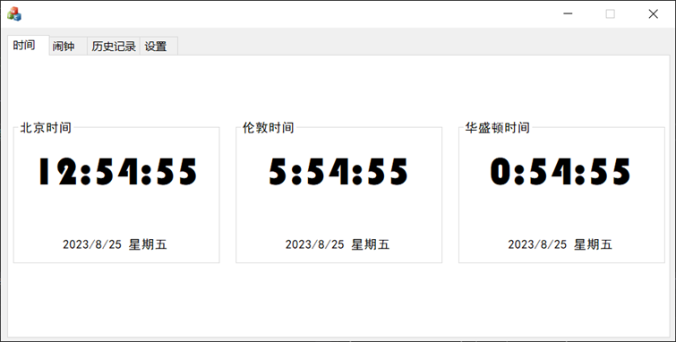
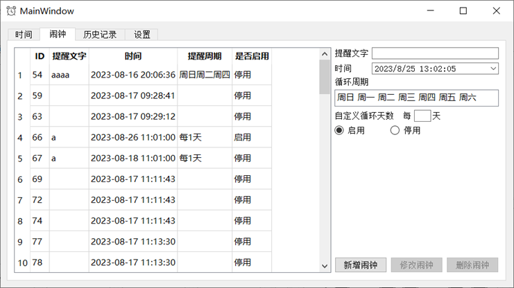

# MFC_QT_CLOCK

- 支持用户设置显示北京时间、东京时间、伦敦时间、华盛顿时间；
- 支持设置闹钟，并自定义闹钟提醒时间、提醒周期、提醒文字、延迟提醒等功能，闹钟数量最多支持512个；
- 实现用户操作历史记录功能，记录用户所有成功的配置修改操作，并支持以操作类型、操作时间区间进行筛选，支持筛选结果导出到txt文档；
- 支持关闭表盘功能，表盘关闭后闹钟最小化到任务栏右下角，其
他功能继续后台执行；

## MFC

## QT

1. 开始时读取设置文件，闹钟，历史记录，更新记录后根据闹钟index和时间创建multimap，以time为key实现按时间排序，begin返回时间最小项
2. 调用函数更新后台各地区时间，并检测是否触发闹钟。
3. 触发闹钟后，超过持续时间，手动关闭或遇到下一个闹钟停止，并更新闹钟记录，过期关闭，周期提醒的改提醒时间。
4. 延迟根据设置时间重新加入闹钟。
5. 调用函数设置提醒时间，周期与文字，时间不为过去，每分钟自动保存，关闭保存。
